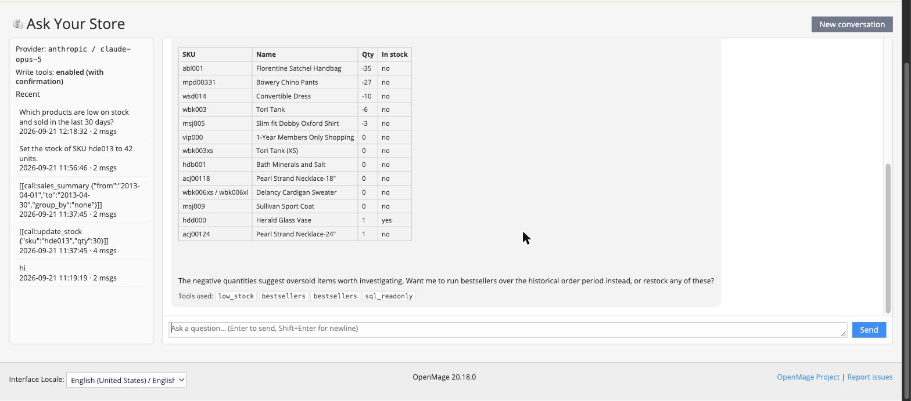
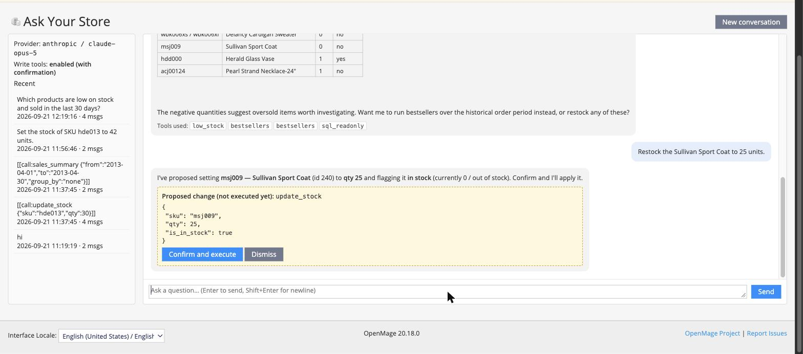
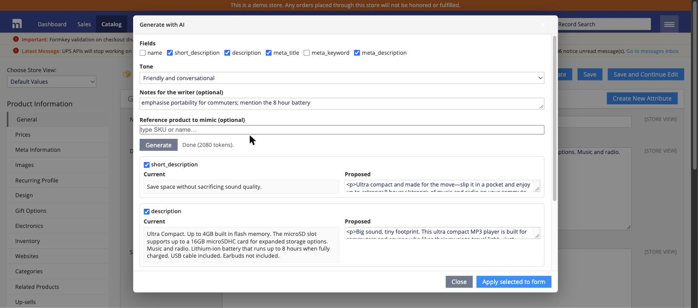
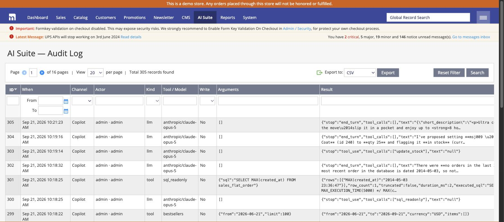
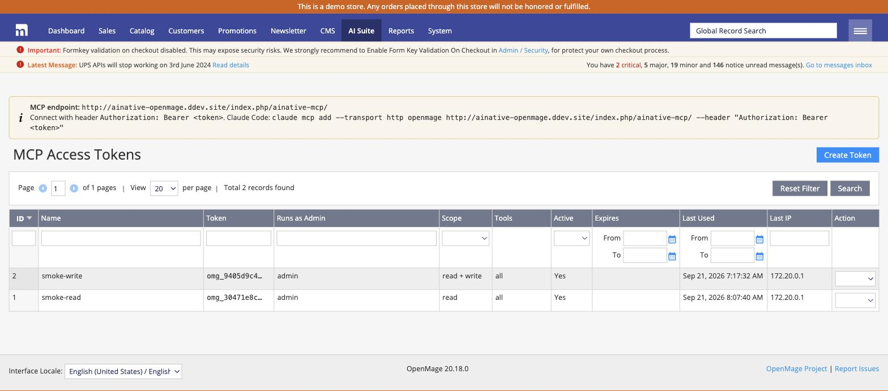

<div align="center">

# OpenMage AI Suite

**Bring AI to the 150,000 storefronts that never left Magento 1.**

[](https://github.com/jestr-ai/openmage-ai-suite/actions/workflows/ci.yml)
[](https://packagist.org/packages/jestr-ai/openmage-ai-suite)
[](LICENSE)
[](https://www.php.net/)
[](https://www.openmage.org/)
[](https://modelcontextprotocol.io)
[](#configuration)
[](tests)

MCP server · Admin copilot · Storefront assistant · LLM discovery
Your infrastructure, your API key, your data.

</div>

---

## Install

From your OpenMage root:

```bash
composer require jestr-ai/openmage-ai-suite
```

OpenMage already ships `magento-hackathon/magento-composer-installer`, which places the files for you. Nothing else to add.

<details>
<summary><b>modman</b></summary>

```bash
modman init            # skip if already initialised
modman clone https://github.com/jestr-ai/openmage-ai-suite
```

</details>

<details>
<summary><b>Manual</b></summary>

Download the latest release and copy the `app/` and `skin/` directories into your OpenMage root. No core files are modified.

</details>

Then:

```bash
# 1. Flush the cache        System > Cache Management > Flush Magento Cache
# 2. Log out and back in    so the new permissions apply
# 3. Configure              System > Configuration > AI Suite
```

**Requirements** OpenMage LTS 20.x or 21.x, PHP 8.1+, cURL. Every feature ships disabled; you turn on only what you want.

> **Deploying to production** OpenMage symlinks Composer modules in development and copies them when you run `composer install --no-dev`. Use `--no-dev` on hosts that do not follow symlinks.

---

## Why

Roughly 150,000 storefronts still run Magento 1 or its maintained fork, OpenMage. They kept a platform that works and skipped a costly replatform. What they lost was access to everything commerce has built since.

Adobe Commerce ships semantic search, catalog agents and agentic checkout. Magento 2 has commercial MCP servers. Magento 1 merchants have had nothing, while AI referral traffic to retail grew several hundred percent year over year and shopping agents began transacting on behalf of customers.

This suite is the missing layer. It installs in an afternoon and runs entirely on your own server.

| | |
|---|---|
| **Talk to your store** | Connect Claude, ChatGPT or any MCP client to your catalog, orders, customers and reports |
| **Write with real context** | Product copy and support replies generated from actual product data |
| **Sell through conversation** | A storefront assistant that quotes real prices and tracks real orders |
| **Be found by AI agents** | Product feed, `llms.txt` and catalog API for AI shopping surfaces |

---

## Features

### Ask your store anything

An endpoint implementing the [Model Context Protocol](https://modelcontextprotocol.io) over Streamable HTTP. Connect any MCP client and ask in plain language.

> *"Which products are low on stock, and how many of each did we sell in the last 90 days?"*



The same tools power an in-admin panel, so staff without an AI subscription get the same capability. Every answer shows which tools produced it.

<table>
<tr><th align="left">Area</th><th align="left">Tools</th></tr>
<tr><td><b>Catalog</b></td><td><code>search_products</code> <code>get_product</code> <code>update_product</code> <code>list_categories</code> <code>list_attributes</code></td></tr>
<tr><td><b>Inventory</b></td><td><code>get_stock</code> <code>update_stock</code></td></tr>
<tr><td><b>Sales</b></td><td><code>list_orders</code> <code>get_order</code> <code>add_order_comment</code></td></tr>
<tr><td><b>Customers</b></td><td><code>search_customers</code> <code>get_customer</code></td></tr>
<tr><td><b>Reporting</b></td><td><code>sales_summary</code> <code>bestsellers</code> <code>low_stock</code> <code>abandoned_carts</code></td></tr>
<tr><td><b>Content</b></td><td><code>get_cms_page</code> <code>update_cms_page</code> <code>list_cart_price_rules</code></td></tr>
<tr><td><b>Platform</b></td><td><code>describe_store</code> <code>get_config</code> <code>sql_readonly</code></td></tr>
</table>

### Changes require a human

The assistant proposes, a person approves. Write operations are held and shown with their exact arguments before anything executes.



Three independent gates guard every write: a store-wide switch, per-token scope, and this confirmation.

### Content generated from your catalog

Generate descriptions and metadata from a product's real attributes. Review each field against the current value and apply only what you want.



Bulk generation runs from the product grid into a review queue. Nothing is written until approved, so a run across a thousand products stays reversible. Order pages gain a customer-service reply drafter.

### A storefront assistant that knows your inventory

Searches the live catalog, quotes the shopper's real prices including their customer group, surfaces promotions, tracks orders and offers add-to-cart.


Works with any theme. No template edits, no jQuery or Prototype conflicts. Transcripts and the most asked questions land in the admin, turning customer language into merchandising insight.

### Discoverable by AI shopping agents

- Product feed in JSON Lines and CSV using the Google Merchant and Agentic Commerce Protocol vocabulary, with variants, GTIN, availability and sale pricing
- `llms.txt` describing the store and pointing agents at machine-readable data
- Paginated catalog API so agents read structured data instead of scraping HTML

---

## Configuration

**1. Add a provider.** Under *AI Suite > Core & Providers*, enable the suite, choose a provider, paste the key and set a model. Write a short *Store Context* describing what you sell and in what tone. It is prepended to every prompt and materially improves output.

| Provider | Notes |
|---|---|
| Anthropic | Claude models, effort control |
| OpenAI | Also any OpenAI-compatible endpoint, including self-hosted Ollama or vLLM |
| Google | Gemini models |

**2. Turn on what you want.** Each capability has its own section. Leave *Allow Write Tools* off until you have used the read-only tools for a while.

**3. Connect a client.** Create a token under *AI Suite > MCP Access Tokens*. Choose the admin user it runs as, pick read or read and write, optionally restrict it to specific tools and set an expiry. The token is shown once.

```bash
claude mcp add --transport http openmage \
  https://your-store.example/ainative-mcp \
  --header "Authorization: Bearer YOUR_TOKEN"
```

| Client | Connection |
|---|---|
| Claude Code | The command above |
| Claude Desktop, claude.ai | Custom connector at `https://your-store.example/ainative-mcp/index/index/t/TOKEN` |
| MCP Inspector | `npx @modelcontextprotocol/inspector`, Streamable HTTP, Authorization header |
| Other MCP clients | Streamable HTTP with a Bearer token |

Browser-based clients need their origin added under *Allowed Origins*. Command-line clients send no origin header and are permitted.

---

## Security

| Control | Behaviour |
|---|---|
| **Credentials** | Encrypted with the store's encryption key, never written to logs |
| **Permissions** | Enforced per call against the admin role of the token's owner |
| **Writes** | Disabled by default; require a write-scoped token and explicit confirmation |
| **SQL access** | Disabled by default. When on: single SELECT only, blocked table prefixes for admin, OAuth, session, configuration, customer and payment data, enforced row limit, statement timeout, read connection |
| **Config reads** | Non-sensitive sections only; anything resembling a credential is withheld |
| **Endpoint** | Origin validation, protocol version checks, per-token rate limiting |
| **Prompt injection** | Tool results are passed as data; system prompts instruct the model to ignore instructions embedded in product text, reviews or comments |
| **Privacy** | Optional masking of customer emails and phone numbers before text reaches a provider; transcript retention enforced nightly |
| **Spend** | Monthly token budget and per-actor rate limits, with usage by provider, model and feature |

Every tool call and model request is logged with actor, arguments, result, token count and duration.



Tokens carry a scope, an optional tool allow-list and an expiry, and can be revoked instantly.



Storefront visitors reach a separate read-only tool set. Guests must supply both an order number and the matching email address to see order details.

---

## Extending

Tools register through configuration, so any module can add its own.

```php
class Vendor_Module_Model_Tool_Example extends AiNative_Core_Model_Tool_Abstract
{
    public function getName(): string { return 'my_tool'; }
    public function getDescription(): string { return 'What this returns and when to use it.'; }
    public function getInputSchema(): array { return $this->schema(['id' => ['type' => 'integer']], ['id']); }
    public function getAclResource(): ?string { return 'admin/catalog/products'; }
    public function execute(array $args, AiNative_Core_Model_Tool_Context $context): array { return ['ok' => true]; }
}
```

```xml
<global>
    <ainative_tools>
        <admin>
            <my_tool><class>vendor_module/tool_example</class></my_tool>
        </admin>
    </ainative_tools>
</global>
```

It becomes available to the MCP server and the admin assistant immediately, with schema validation, permission checks, write gating, rate limiting and audit logging applied automatically.

---

## Development

```bash
dev/setup-openmage.sh
```

Provisions a complete OpenMage 20.18 store with sample data in ddev, links this repository with modman, and enables an offline mock provider so every flow can be exercised without API spend.

```bash
ddev exec 'cd /var/www/suite && OPENMAGE_ROOT=/var/www/html php /var/www/html/vendor/bin/phpunit -c .phpunit.dist.xml'
```

See [docs/DEVELOPMENT.md](docs/DEVELOPMENT.md) for architecture notes and platform specifics.

---

## Roadmap

| Version | Scope |
|---|---|
| **1.1** | OAuth 2.1 for MCP, streaming responses, semantic search with embeddings, standalone widget embed for non-Magento sites |
| **2.0** | Agentic Commerce Protocol checkout, Unified Commerce Protocol |

---

## Licence

MIT. See [LICENSE](LICENSE).

Not affiliated with or endorsed by Adobe. Magento is a trademark of Adobe Inc.
